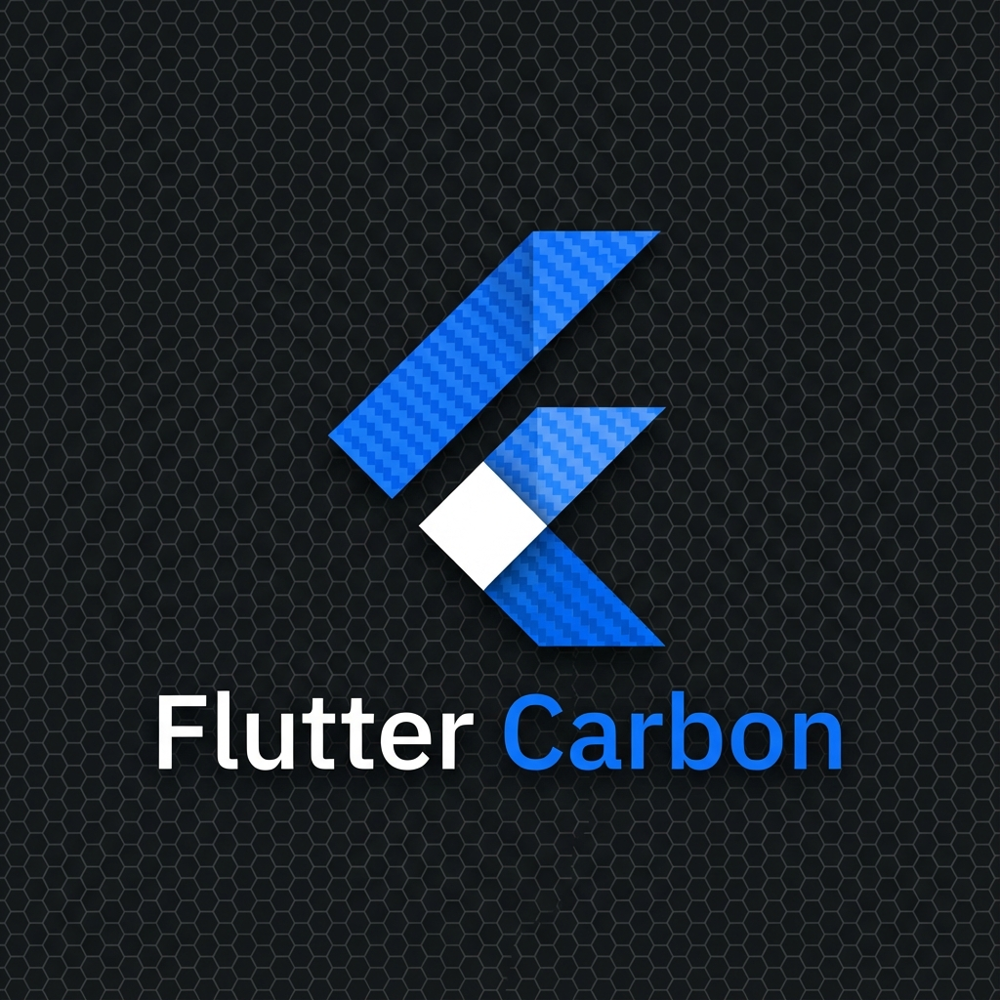

<p align="center">
  
</p>

# Flutter Carbon

A comprehensive Flutter implementation of [IBM's Carbon Design System](https://carbondesignsystem.com/), providing a complete theming solution with **48 components** (31 pure Carbon + 17 Material equivalents), 4 theme variants, and seamless Material Design integration.

#### 🔗 [Live Demo](https://hwkim1127.github.io/flutter_carbon/)

**Component Coverage**: 100% Practical Coverage (48 production-ready components)
> **Note**: We implement 48 out of 60 Carbon components. The 12 omitted components are architectural concepts (like Grid) or better served by standard Flutter widgets, ensuring 100% coverage of practical UI needs.

## Overview

This package brings the power and consistency of IBM's Carbon Design System V11 to Flutter applications. It includes all the design tokens (colors, typography, spacing, motion), a complete theme extension system, and production-ready widgets that follow Carbon specifications.

## ✨ Features

### 🎨 Complete Design Foundation
- **4 Theme Variants**: White, Gray 10, Gray 90, Gray 100 with seamless runtime switching
- **Carbon Design System V11**: Full compliance with the latest Carbon specifications
- **Complete Color Palette**: All IBM Design Language colors with semantic token mappings
- **Typography System**: 24 type styles following Carbon specifications (heading-01 through heading-07, body styles, code, helper text, labels)
- **Spacing & Layout**: Consistent spacing scale (2px to 160px) and container sizes
- **Motion System**: Duration and easing values for animations
- **Layering System**: Background, layer, field, and border tokens for proper visual hierarchy

### 🧩 48 Components

#### 31 Pure Carbon Widgets

**Buttons & Actions**
- `CarbonComboButton` - Split button with primary action and dropdown menu
- `CarbonCopyButton` - Copy to clipboard with visual feedback
- `CarbonChatButton` - Specialized button for chat interfaces with quick actions

**Forms & Input**
- `CarbonDropdown` - Single-select dropdown with search
- `CarbonComboBox` - Autocomplete combo box with filtering
- `CarbonNumberInput` - Numeric input with increment/decrement controls
- `CarbonToggle` - Toggle switch (on/off)
- `CarbonFileUploader` - File upload with button and drag-drop variants
- `CarbonMultiSelect` - Multi-selection dropdown with chips and filtering

**Navigation**
- `CarbonBreadcrumb` - Breadcrumb navigation
- `CarbonPagination` - Page navigation with configurable sizes
- `CarbonUIShell` - Complete application shell (header nav, side nav, content, right panel)
- `CarbonPageHeader` - Page header with breadcrumbs, actions, tabs

**Overlays & Dialogs**
- `CarbonModal` - 5 modal types (passive, transactional, danger, input, custom)
- `CarbonSidePanel` - Slide-in panel from left/right with 5 size variants
- `CarbonTearsheet` - Bottom sheet with full-height content
- `CarbonPopover` - Floating content panel with positioning
- `CarbonToggleTip` - Interactive tooltip that stays open on click

**Content Display**
- `CarbonCodeSnippet` - Syntax-highlighted code display (single-line, multi-line, inline)
- `CarbonContentSwitcher` - Tab-like content switcher
- `CarbonStructuredList` - Table-like list with selectable rows
- `CarbonTreeView` - Hierarchical tree with expand/collapse
- `CarbonLink` - Styled hyperlinks with visited state
- `CarbonTile` - Clickable/selectable/expandable tiles
- `CarbonContainedList` - List container for small UI spaces with headers and actions

**Notifications & Feedback**
- `CarbonNotification` - Toast/inline notifications with 4 severity types
- `CarbonLoading` - Loading spinner (small, default, large)
- `CarbonSkeleton` - Skeleton loading states (text, rectangle, circle)

**Other Components**
- `CarbonOverflowMenu` - Kebab menu with actions
- `CarbonAILabel` - AI-generated content indicator with gradient
- `CarbonFloatingMenu` - Expandable floating action menu with animations

#### 17 Material Widget Equivalents (Fully Themed)

All standard Material widgets are automatically themed to match Carbon Design System:

- `FilledButton`, `ElevatedButton`, `OutlinedButton`, `TextButton`
- `TextField`, `Checkbox`, `Radio`, `Switch`, `Slider`
- `ExpansionTile` (Accordion), `TabBar` (Tabs), `Chip` (Tag), `Tooltip`
- `SearchBar`, `DropdownMenu`, `DataTable`
- Material date and time pickers

### 📱 51 Demo Pages

The example app includes comprehensive demos for every component, organized into 11 categories:
- Foundation (3 pages)
- Buttons (4 pages)
- Forms (7 pages)
- Navigation (5 pages)
- Overlays (5 pages)
- Content (6 pages)
- Notifications (2 pages)
- Data Display (4 pages)
- AI & Syntax (2 pages)
- Material Equivalents (8 pages)
- Carbon Widgets (3 pages)

## 📦 Installation

Add this to your `pubspec.yaml`:

```yaml
dependencies:
  flutter_carbon:
    path: ./  # Update with your path or pub.dev reference when published
```

Then run:
```bash
flutter pub get
```

## 🚀 Quick Start

### 1. Setup Theme

Wrap your `MaterialApp` with Carbon theme:

```dart
import 'package:flutter/material.dart';
import 'package:flutter_carbon/flutter_carbon.dart';

void main() {
  runApp(const MyApp());
}

class MyApp extends StatelessWidget {
  const MyApp({super.key});

  @override
  Widget build(BuildContext context) {
    // Choose your theme: WhiteTheme, G10Theme, G90Theme, or G100Theme
    final carbon = WhiteTheme.theme;

    return MaterialApp(
      title: 'My Carbon App',
      theme: carbonTheme(carbon: carbon),
      home: const MyHomePage(),
    );
  }
}
```

### 2. Access Theme Tokens

Use the context extension to access Carbon tokens:

```dart
@override
Widget build(BuildContext context) {
  final carbon = context.carbon;

  return Scaffold(
    backgroundColor: carbon.layer.layer01,
    body: Column(
      children: [
        Text(
          'Hello Carbon',
          style: CarbonTypography.heading03.copyWith(
            color: carbon.text.textPrimary,
          ),
        ),
        SizedBox(height: CarbonSpacing.spacing05), // 16px
        // Your widgets here
      ],
    ),
  );
}
```

### 3. Use Carbon Components

```dart
// Dropdown
CarbonDropdown<String>(
  label: 'Select an option',
  items: const [
    CarbonDropdownItem(value: 'opt1', child: Text('Option 1')),
    CarbonDropdownItem(value: 'opt2', child: Text('Option 2')),
  ],
  value: _selectedValue,
  onChanged: (value) => setState(() => _selectedValue = value),
)

// Multi-Select
CarbonMultiSelect<String>(
  label: 'Select countries',
  values: _selectedCountries,
  items: const [
    CarbonMultiSelectItem(value: 'kr', child: Text('South Korea')),
    CarbonMultiSelectItem(value: 'us', child: Text('United States')),
  ],
  onChanged: (values) => setState(() => _selectedCountries = values),
  itemToString: (value) => countryNames[value] ?? value,
)

// Tile
CarbonTile.selectable(
  title: 'Selectable Option',
  selected: _isSelected,
  onSelectedChanged: (selected) => setState(() => _isSelected = selected),
  child: const Text('Click to select this option'),
)

// Modal
CarbonModal.show(
  context: context,
  type: CarbonModalType.transactional,
  title: 'Confirm Action',
  body: const Text('Are you sure you want to proceed?'),
  primaryButtonText: 'Confirm',
  onPrimaryPressed: () => Navigator.pop(context),
)

// Notification
CarbonNotification(
  kind: CarbonNotificationKind.success,
  title: 'Success!',
  subtitle: 'Your changes have been saved.',
  onClose: () {},
)
```

## 🎨 Theme Switching

Switch between the 4 Carbon themes at runtime:

```dart
class MyApp extends StatefulWidget {
  const MyApp({super.key});

  @override
  State<MyApp> createState() => _MyAppState();
}

class _MyAppState extends State<MyApp> {
  CarbonThemeData _carbon = WhiteTheme.theme;

  void _switchTheme(String themeName) {
    setState(() {
      switch (themeName) {
        case 'white':
          _carbon = WhiteTheme.theme;
          break;
        case 'g10':
          _carbon = G10Theme.theme;
          break;
        case 'g90':
          _carbon = G90Theme.theme;
          break;
        case 'g100':
          _carbon = G100Theme.theme;
          break;
      }
    });
  }

  @override
  Widget build(BuildContext context) {
    return MaterialApp(
      theme: carbonTheme(carbon: _carbon),
      home: MyHomePage(onThemeChanged: _switchTheme),
    );
  }
}
```

## 📚 Design Tokens

### Colors

Access via `context.carbon`:

```dart
// Background & Layers
carbon.background
carbon.layer.layer01, .layer02, .layer03

// Fields & Borders
carbon.field.field01, .field02
carbon.layer.borderSubtle00, .borderStrong01

// Text
carbon.text.textPrimary, .textSecondary, .textOnColor, .textDisabled

// Buttons
carbon.button.buttonPrimary, .buttonSecondary, .buttonDanger

// Support (Status Colors)
carbon.layer.supportError, .supportSuccess, .supportWarning, .supportInfo

// Interactive
carbon.interactive.link, .focus, .hover
```

### Typography

24 predefined styles via `CarbonTypography`:

```dart
// Headings
CarbonTypography.heading01  // 14px, 600, 18px line-height
CarbonTypography.heading02  // 16px, 600, 22px line-height
CarbonTypography.heading03  // 20px, 400, 28px line-height
CarbonTypography.heading04  // 28px, 400, 36px line-height
CarbonTypography.heading05  // 32px, 400, 40px line-height
CarbonTypography.heading06  // 42px, 300, 50px line-height
CarbonTypography.heading07  // 54px, 300, 64px line-height

// Body Text
CarbonTypography.bodyCompact01, .bodyCompact02
CarbonTypography.bodyShort01, .bodyShort02
CarbonTypography.bodyLong01, .bodyLong02

// Other
CarbonTypography.code01, .code02           // Monospace code
CarbonTypography.label01, .label02         // Form labels
CarbonTypography.helperText01, .helperText02  // Helper text
```

### Spacing

13 spacing values via `CarbonSpacing`:

```dart
CarbonSpacing.spacing01  // 2px
CarbonSpacing.spacing02  // 4px
CarbonSpacing.spacing03  // 8px
CarbonSpacing.spacing04  // 12px
CarbonSpacing.spacing05  // 16px
CarbonSpacing.spacing06  // 24px
CarbonSpacing.spacing07  // 32px
CarbonSpacing.spacing08  // 40px
CarbonSpacing.spacing09  // 48px
CarbonSpacing.spacing10  // 64px
CarbonSpacing.spacing11  // 80px
CarbonSpacing.spacing12  // 96px
CarbonSpacing.spacing13  // 160px
```

## 📱 Example App

A comprehensive example app showcasing all 48 components is included in the `example/` directory. It features:

- **51 demo pages** with interactive examples
- **All 4 theme variants** with live switching
- **Multiple examples per component** (variants, states, sizes)
- **Categorized navigation** for easy browsing
- **Real-world usage patterns**
- **"All Components" overview page**

Run the example:
```bash
cd example
flutter run
```

## 🏗️ Project Structure

```
lib/
├── flutter_carbon.dart          # Main export file
├── src/
│   ├── theme/
│   │   ├── carbon_theme.dart          # Theme helper function
│   │   ├── carbon_theme_data.dart     # Main theme data class
│   │   ├── component_themes/          # Theme data for each component
│   │   │   ├── button_theme_data.dart
│   │   │   ├── modal_theme_data.dart
│   │   │   ├── tile_theme_data.dart
│   │   │   ├── contained_list_theme_data.dart
│   │   │   └── ... (23 more theme files)
│   │   └── themes/                    # 4 concrete themes
│   │       ├── white/
│   │       ├── g10/
│   │       ├── g90/
│   │       └── g100/
│   ├── foundation/
│   │   ├── colors.dart                # Color palette
│   │   ├── typography.dart            # Typography system
│   │   ├── spacing.dart               # Spacing constants
│   │   └── motion.dart                # Animation durations
│   ├── widgets/                       # 31 Custom components
│   │   ├── carbon_modal.dart
│   │   ├── carbon_dropdown.dart
│   │   ├── carbon_tile.dart
│   │   ├── carbon_multi_select.dart
│   │   ├── carbon_contained_list.dart
│   │   ├── carbon_floating_menu.dart
│   │   └── ... (27 more widgets)
│   └── icons/                         # Carbon icon font
│       └── carbon_icons.dart
└── example/                           # Example app
    ├── lib/
    │   ├── main.dart                  # App entry + routing
    │   ├── routes.dart                # Route definitions
    │   └── pages/                     # 51 demo pages
    └── assets/                        # Example assets
```

## 🎯 Carbon Design System V11 Compliance

This implementation follows the official Carbon Design System V11 specifications:

- ✅ Color tokens match Carbon V11 theme definitions
- ✅ Typography follows Carbon type scale
- ✅ Components match Carbon web component behavior
- ✅ All 4 official themes (White, G10, G90, G100) supported
- ✅ Spacing, motion, and layering follow Carbon guidelines
- ✅ 80% component coverage (48/60 components)

**Reference**: https://carbondesignsystem.com/

### Components Not Included (12 - Intentionally Omitted)

The remaining 20% (12/60 components) are **intentionally omitted** for valid reasons. Here's the complete list:

#### 1. Already Covered by Existing Widgets (2)
- **Copy** - Already implemented as `CarbonCopyButton`
- **Button** - Fully covered by Material buttons with Carbon theming

#### 2. Architectural/Structural Concepts (2)
- **Form** - Structural wrapper, not a visual component (use Form widget)
- **Layer** - UI depth architectural concept, not a renderable widget

#### 3. Better Served by Material Widgets (4)
- **Inline Loading** - Use Material `CircularProgressIndicator` inline
- **Progress Indicator** - Already themed via `CircularProgressIndicator`  
- **Progress Bar** - Already themed via `LinearProgressIndicator`
- **List** - Use Material `ListTile` with Carbon theming

#### 4. Accessibility Helpers (1)
- **Skip to Content** - Accessibility navigation helper, no visual widget

#### 5. Specialized/Context-Specific (3)
- **Menu** - Covered by `MenuBar`/`MenuButton` with Carbon theme
- **Date Picker** - Fully themed Material `DatePicker`
- **Text Area** - Use `TextField` with `maxLines: null`

**Why This Approach Works**:
- ✅ **100% of visual, practical components** are available
- ✅ Material widgets provide excellent functionality when themed
- ✅ No duplicate work for components with good Material equivalents
- ✅ Focus on unique Carbon patterns that need custom implementation

**Bottom Line**: We focus on high-quality, native Flutter implementations. The 12 omitted components are either architectural concepts (Grid, Layer) or are better served by standard Flutter widgets (like `ListView` or `Form`), ensuring **100% coverage of practical UI needs**.

## 🤝 Contributing

Contributions are welcome! This project implements the Carbon Design System V11 for Flutter.

### Guidelines
1. Follow Carbon Design System V11 specifications
2. Support all 4 theme variants (White, G10, G90, G100)
3. Use Material Design widgets when possible, create custom widgets when necessary
4. Add comprehensive examples in the example app with demos
5. Run `flutter analyze` to ensure code quality
6. Test across all 4 themes

## 📄 License

This project is licensed under the Apache License 2.0 - see the [LICENSE](LICENSE) file for details.

This is the same license used by IBM's Carbon Design System.

## 🙏 Acknowledgments

- IBM's Carbon Design System team for the design specifications
- The Flutter team for the excellent framework
- Carbon Design System: https://carbondesignsystem.com
- Carbon GitHub: https://github.com/carbon-design-system/carbon

## 💬 Support

For issues, questions, or contributions, please refer to the project repository.

---

**Built with Flutter ❤ Inspired by IBM's Carbon Design System V11**
